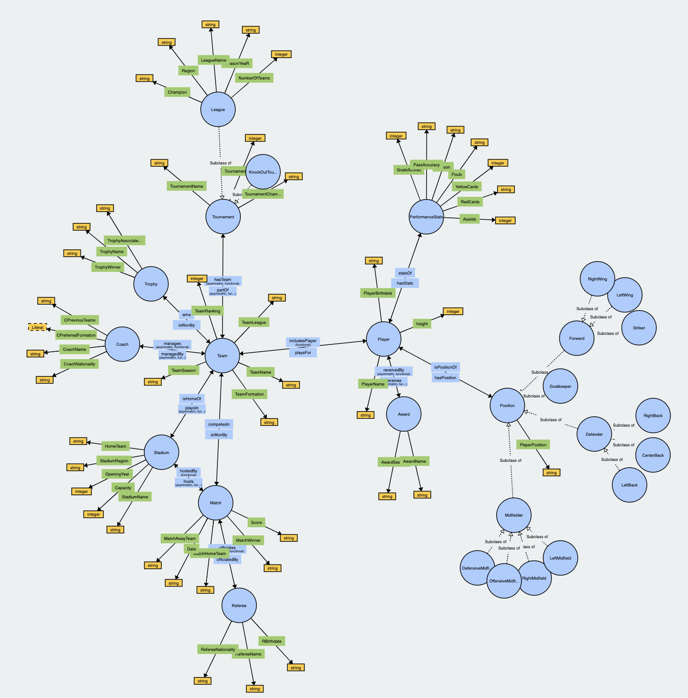

## About

The Football Ontology is a comprehensive knowledge representation framework designed to capture and organize essential information related to the world of football (soccer). This ontology aims to provide a structured and standardized way to model various entities and concepts within the football domain, including players, teams, leagues, matches, referees, coaches, and more. By leveraging Semantic Web technologies such as OWL, the Football Ontology facilitates data integration, interoperability, and advanced querying for football-related applications, including analytics, visualization, and decision support systems.

## Intended Use
The intended use of the football ontology is to provide a wide range of applications aimed at data management, analysis, and decision making in the football domain.The ontology serves as a knowledge representation framework, supporting the integration of diverse football-related data sources and enabling researchers, analysts, and other stakeholders valuable insights. The goal is to develop a standardized football ontology, which could be used for decision-making processes by providing knowledge about player performance, team strategies, and match outcomes.

A full diagram with properties and data types was also built using WebVOWL

